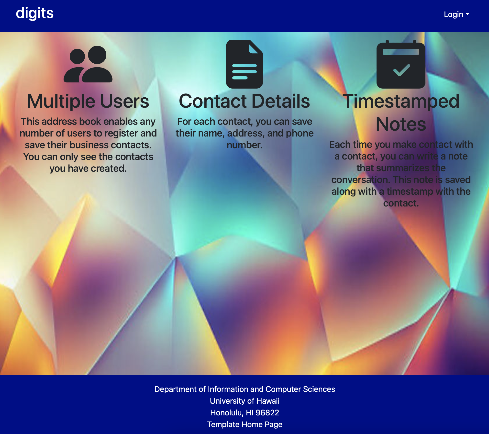
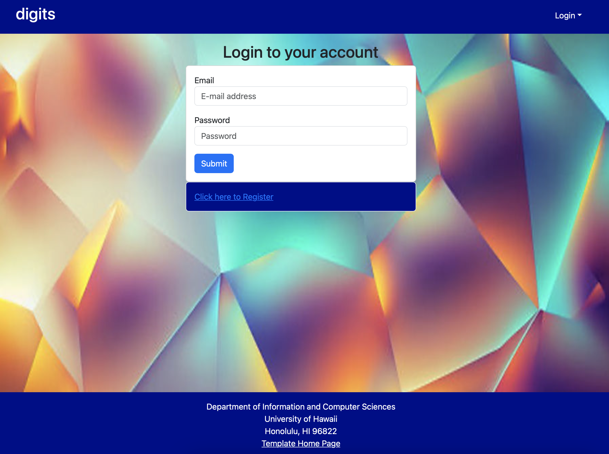
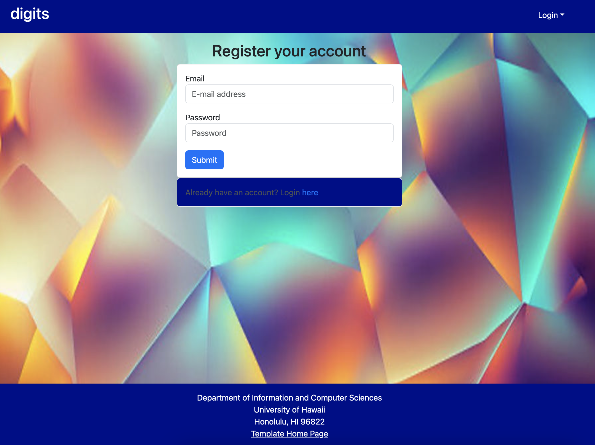
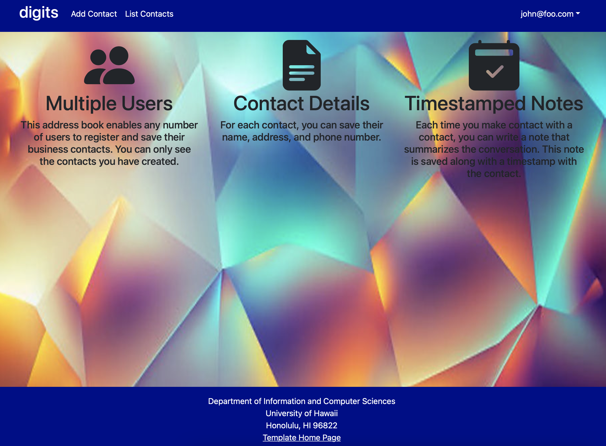
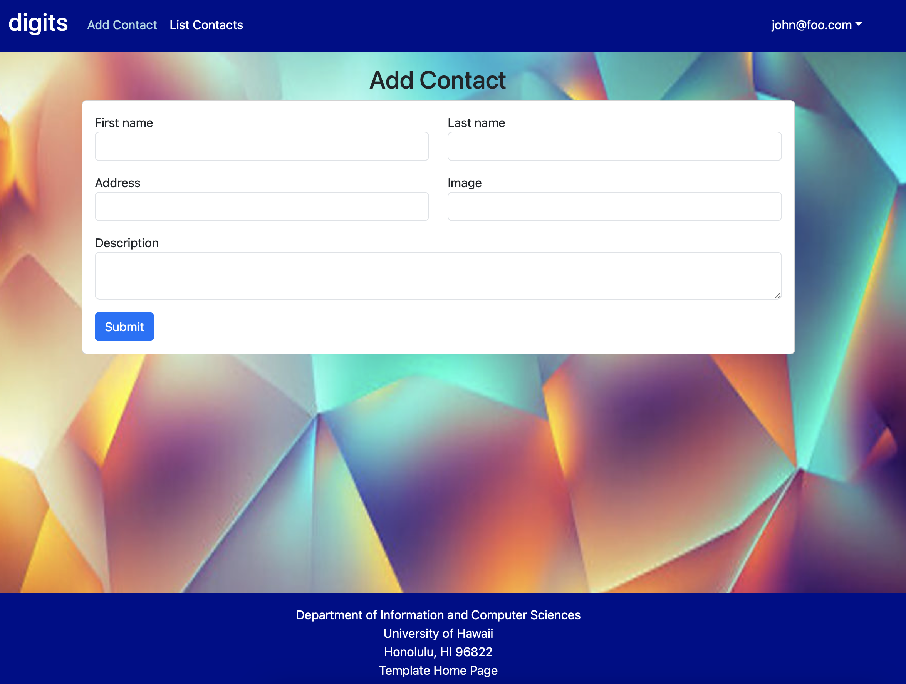
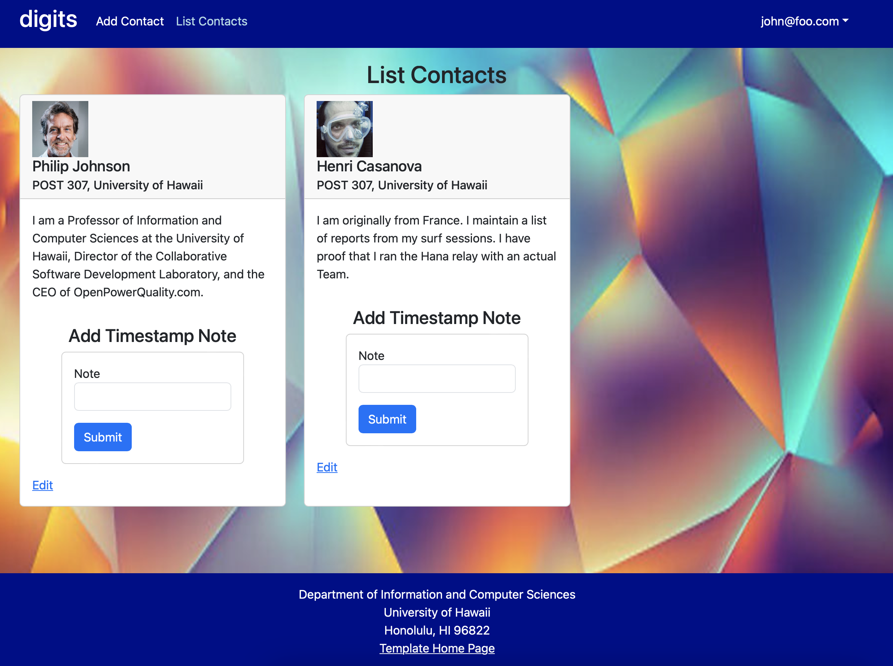
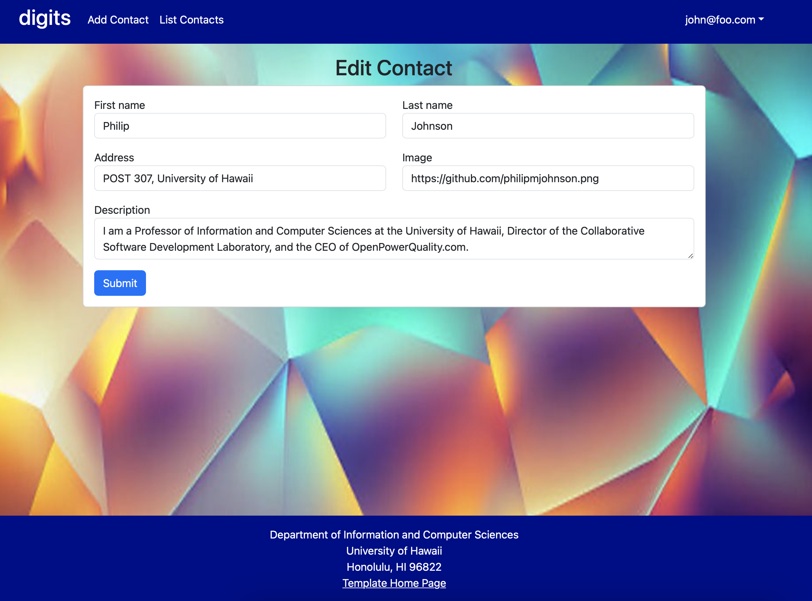
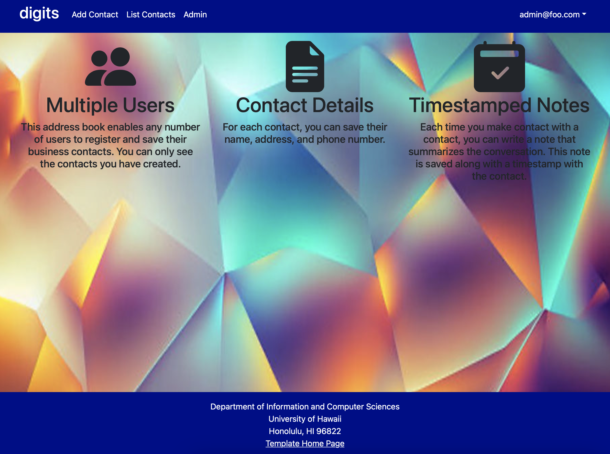
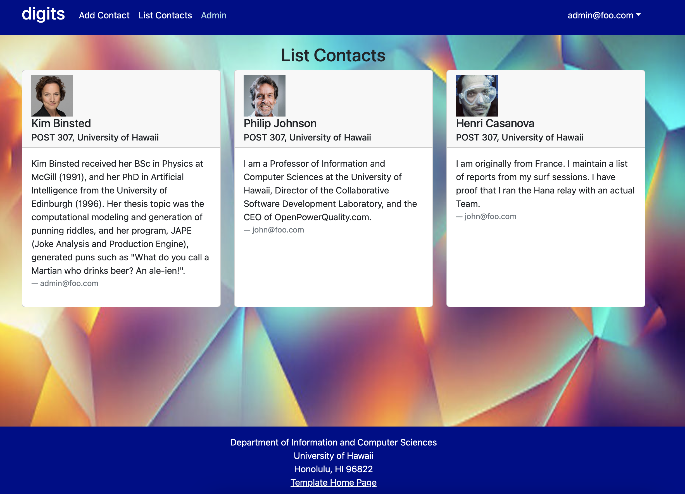

# Digits



Digits is an application that allows users to:
  * Register an account.
  * Create and manage a set of contacts.
  * Add a set of timestamped notes regarding their interactions with each contact.

# Installation

First, install Meteor.

Second, download a copy of Digits. Note that Digits is a private repo and so you will need to request permission from the author to gain access to the repo.

Third, cd into the app directory install the required libraries with:

To keep this codebase simple and small, some important capabilities are intentionally excluded from this template:

  * Unit Testing.
  * Security (meteor-application-template-react enables the insecure packages)
  * Deployment

Examples of the these capabilities will be provided elsewhere.

## Installation

First, [install Meteor](https://www.meteor.com/install).

Second, download a copy of Digits. Note that Digits is a private repo and so you will need to request permission from the author to gain access to the repo.

Third, cd into the app directory install the required libraries with:

```
$ meteor npm install
```

## Running the system

Once the libraries are installed, you can run the application by invoking the "start" script in the [package.json file](https://github.com/ics-software-engineering/meteor-application-template-react/blob/master/app/package.json):

```
$ meteor npm run start
```

The first time you run the app, it will create some default users and data. Here is the output:

```
 meteor npm run start 

> meteor-application-template-react@ start /Users/carletonmoore/GitHub/ICS314/meteor-application-template-react/app
> meteor --no-release-check --exclude-archs web.browser.legacy,web.cordova --settings ../config/settings.development.json

[[[[[ ~/GitHub/ICS314/meteor-application-template-react/app ]]]]]

=> Started proxy.                             
=> Started HMR server.                        
=> Started MongoDB.                           
I20220529-12:09:18.384(-10)? Creating the default user(s)
I20220529-12:09:18.389(-10)?   Creating user admin@foo.com.
I20220529-12:09:18.453(-10)?   Creating user john@foo.com.
I20220529-12:09:18.515(-10)? Creating default data.
I20220529-12:09:18.515(-10)?   Adding: Basket (john@foo.com)
I20220529-12:09:18.599(-10)?   Adding: Bicycle (john@foo.com)
I20220529-12:09:18.600(-10)?   Adding: Banana (admin@foo.com)
I20220529-12:09:18.601(-10)?   Adding: Boogie Board (admin@foo.com)
I20220529-12:09:18.773(-10)? Monti APM: completed instrumenting the app
=> Started your app.

=> App running at: http://localhost:3000/
```

Periodically, you might see `Error starting Mongo (2 tries left): Cannot run replSetReconfig because the node is currently updating its configuration` after the `=> Started HMR server.`. It doesn't seem to be a problem since the MongoDB does start.

### Viewing the running app

If all goes well, the template application will appear at [http://localhost:3000](http://localhost:3000).  You can login using the credentials in [settings.development.json](https://github.com/ics-software-engineering/meteor-application-template-react/blob/main/config/settings.development.json), or else register a new account.

### ESLint

You can verify that the code obeys our coding standards by running ESLint over the code in the imports/ directory with:

```
meteor npm run lint
```

### Application functionality

The application implements a simple CRUD application for managing "Contact", which is a Mongo Collection consisting of a name (String), a quantity (Number), a condition (one of 'excellent', 'good', 'fair', or 'poor') and an owner.

By default, each user only sees the Contacts that they have created.  However, the settings file enables you to define default accounts.  If you define a user with the role "admin", then that user gets access to a special page which lists all the Contacts defined by all users.

#### Landing page

When you retrieve the app at http://localhost:3000, this is what should be displayed:


The next step is to use the Login menu to either Login to an existing account or register a new account.

#### Login page

Clicking on the Login link, then on the Sign In menu item displays this page:



#### Register page

Alternatively, clicking on the Login link, then on the Sign Up menu item displays this page:



#### Landing (after Login) page, non-Admin user

Once you log in (either to an existing account or by creating a new one), the navbar changes as follows:



You can now add new Contacts , and list the Contacts you have created. Note you cannot see any Contacts created by other users.

#### Add Contact page

After logging in, here is the page that allows you to add new Contacts:



#### List Contacts page

After logging in, here is the page that allows you to list all the Contacts you have created:



You click the "Edit" link to go to the Edit Contact page, shown next.

#### Edit Contact page

After clicking on the "Edit" link associated with an item, this page displays that allows you to change and save it:



#### Landing (after Login), Admin user

You can define an "admin" user in the settings.json file. This user, after logging in, gets a special entry in the navbar:



#### Admin page (list all Contacts)

To provide a simple example of a "super power" for Admin users, the Admin page lists all of the Contacts by all of the users:



Note that non-admin users cannot get to this page, even if they type in the URL by hand.

### Collections

The application implements a single Collection called "Contacts". Each Contacts document has the following fields: name, quantity, condition, and username.

The Contacts collection is defined in [imports/api/Contact/Contacts.js](https://github.com/ics-software-engineering/meteor-application-template-react/blob/main/app/imports/api/Contact/Contacts.js).

The Contacts collection is initialized in [imports/startup/server/Mongo.js](https://github.com/ics-software-engineering/meteor-application-template-react/blob/main/app/imports/startup/server/Mongo.js).

### CSS

The application uses the [React implementation of Bootstrap 5](https://react-bootstrap.github.io/). You can adjust the theme by editing the `app/client/style.css` file. To change the theme override the Bootstrap 5 CSS variables.

```css
/* Change bootstrap variable values.
 See https://getbootstrap.com/docs/5.2/customize/css-variables/
 */
body {
  --bs-light-rgb: 236, 236, 236;
}

/* Define custom styles */
.gray-background {
  background-color: var(--bs-gray-200);
  color: var(--bs-dark);
  padding-top: 10px;
  padding-bottom: 20px;
}
```

### Routing

For display and navigation among its four pages, the application uses [React Router](https://reacttraining.com/react-router/).

Routing is defined in [imports/ui/layouts/App.jsx](https://github.com/ics-software-engineering/meteor-application-template-react/blob/main/app/imports/ui/layouts/App.jsx).


### Authentication

For authentication, the application uses the Meteor accounts package.

When the application is run for the first time, a settings file (such as [config/settings.development.json](https://github.com/ics-software-engineering/meteor-application-template-react/blob/main/config/settings.development.json)) should be passed to Meteor. That will lead to a default account being created through the code in [imports/startup/server/accounts.js](https://github.com/ics-software-engineering/meteor-application-template-react/blob/main/app/imports/startup/server/accounts.js).

The application allows users to register and create new accounts at any time.

### Authorization

Only logged in users can manipulate Contact documents (but any registered user can manipulate any Contact document, even if they weren't the user that created it.)

### Configuration

The [config](https://github.com/ics-software-engineering/meteor-application-template-react/blob/main/config) directory is intended to hold settings files.  The repository contains one file: [config/settings.development.json](https://github.com/ics-software-engineering/meteor-application-template-react/blob/main/config/settings.development.json).

The [.gitignore](https://github.com/ics-software-engineering/meteor-application-template-react/blob/main/.gitignore) file prevents a file named settings.production.json from being committed to the repository. So, if you are deploying the application, you can put settings in a file named settings.production.json and it will not be committed.

### Quality Assurance

#### ESLint

The application includes a [.eslintrc](https://github.com/ics-software-engineering/meteor-application-template-react/blob/main/app/.eslintrc) file to define the coding style adhered to in this application. You can invoke ESLint from the command line as follows:

```
[~/meteor-application-template-react/app]-> meteor npm run lint

> meteor-application-template-react@ lint /Users/philipjohnson/meteor-application-template-react/app
> eslint --quiet ./imports
```

ESLint should run without generating any errors.

It's significantly easier to do development with ESLint integrated directly into your IDE (such as IntelliJ).
